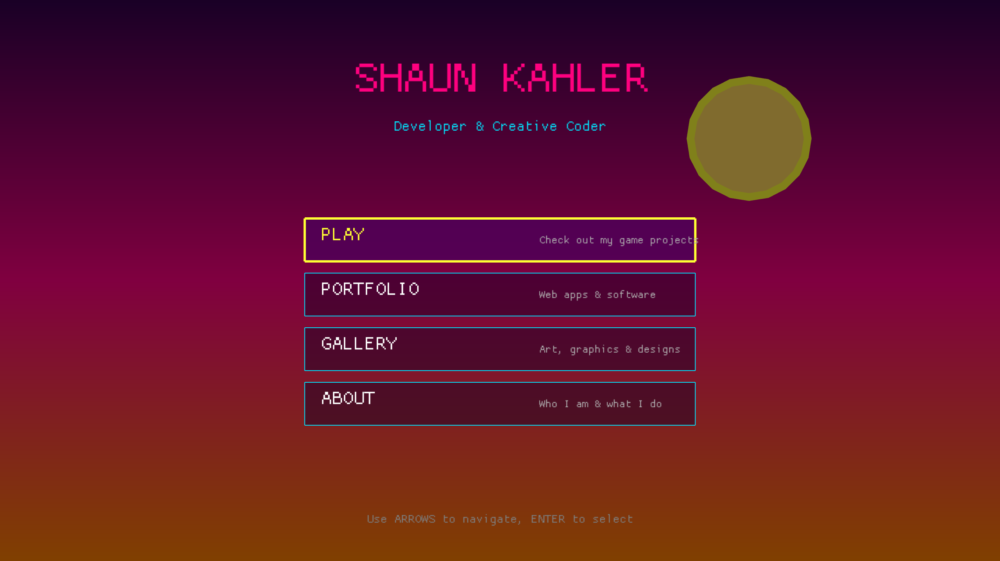

# shaunkahler.com

<div align="center">
  
</div>

A personal portfolio site built with Rust and [Macroquad](https://macroquad.rs/), featuring a unique retro game-like navigation experience.


## Sections

- **Play** - Game projects and prototypes
- **Portfolio** - Web apps, software, and other projects
- **Gallery** - Art, graphics, and creative work
- **About** - Bio and skills

## Controls

- **Navigate**: `W`/`S` or `Up`/`Down` arrows
- **Select**: `Enter` or `Space`
- **Go Back**: `Escape`

## Getting Started

### Prerequisites

You'll need the Rust toolchain installed. If you don't have it, get it at [rustup.rs](https://rustup.rs/).

### Running

```bash
cargo run
```

## Tech Stack

- Rust
- Macroquad game engine
- Custom UI rendering with neon aesthetic
